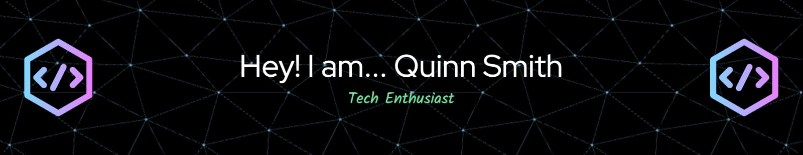

<!-- Profile Banner -->
 
 

---

<!-- Visitors Badge -->

  

---

<!-- Skills -->

## Skills

> Standards, Protocols, Formats

 

 

 

 

> Cloud Providers

> Programming Languages

> Development Tools

> Databases, Caches, Storage

> Integrations, Middleware

> DevOps Ecosystem

> Python Ecosystem

> Java Ecosystem

> Go Ecosystem

> Web Ecosystem

> Testing Ecosystem

> Monitoring Ecosystem

> Security

> AI / ML

> Graphics & Design

> Music

> Microcontrollers

> Project Management & Collaboration

> Compliance

<!--
Badges from: https://shields.io
Logos from: https://simpleicons.org
-->